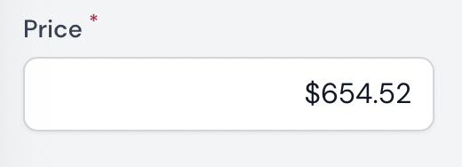

# Filament-mrk

[](https://packagist.org/packages/morkcode/filament-mrk)
[](https://packagist.org/packages/morkcode/filament-mrk)

This package is for personal configuration.

## Installation

You can install the package via composer:

```bash
composer require morkcode/filament-mrk
```

You can publish the config file with:

```bash
php artisan vendor:publish --tag="filament-mrk-config"
```

This is the contents of the published config file: (soon)
```php
return [
];
```


## Forms

---

### **Cash Input**

Aling price to the rigth



```php
use FilamentMrk\Forms\Components\CashInput;

CashInput::make('price')
    ->required(),

```

### **Cash Input**


```php
use FilamentMrk\Forms\Components\ToggleCheck;

ToggleCheck::make('enable')
    ->required(),

```

---

## License

The MIT License (MIT). Please see [License File](LICENSE.md) for more information.
